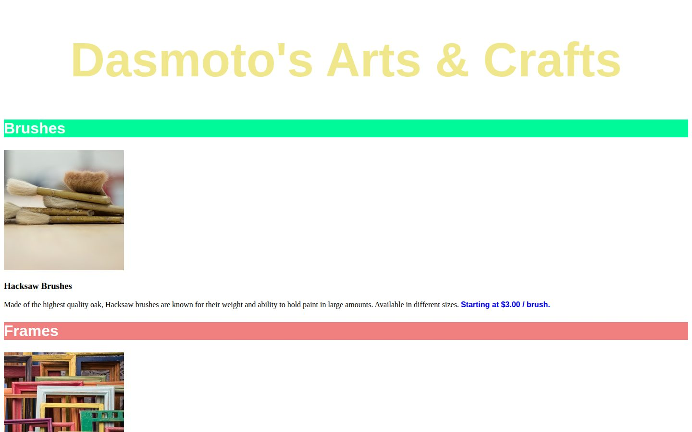

# Dasmoto's Arts & Crafts

A small product page for an art supply shop, written while learning CSS selectors, colors, and backgrounds. Based on the Codecademy project of the same name.

## What's inside

- Colored heading and section banners
- Product sections with images, descriptions, and prices

## Built with

- HTML
- CSS

## Run locally

No build step. Open `index.html` in a browser.
